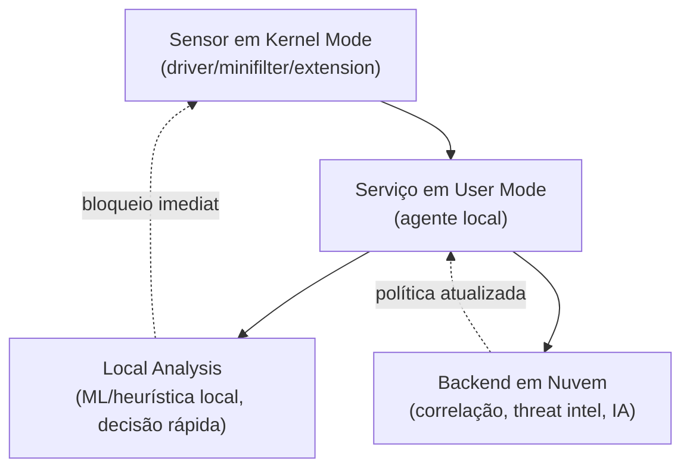

# Escalonamento para Ring 0: Técnicas de Malware e Detecção por EDR

> [!info] Sobre esta nota
> Extensão direta de [Arquitetura de Computadores para Forense Digital](../Fundamentos/Arquitetura%20de%20Computadores%20para%20Forense%20Digital.md), seção de Rings de Proteção. Enquanto aquela nota explica **o que** são os rings e por que existem, esta cobre **como um malware efetivamente chega a Ring 0**, **o que ele faz de lá**, **como detectar isso manualmente**, e **como um EDR como o Cortex XDR monitora esse nível** em tempo real.

---

## 1. Recapitulando: por que uma aplicação não "sobe" de ring sozinha

Como visto na nota de arquitetura, uma aplicação em Ring 3 nunca executa seu próprio código em Ring 0 — ela sempre depende de uma **transição controlada por hardware**: syscall, interrupção, ou exceção. O processador troca de modo, o **kernel** executa em nome da aplicação, e devolve o controle. Nunca é a aplicação "decidindo" rodar em modo privilegiado.

Isso significa que, para um malware rodar código arbitrário em Ring 0, ele precisa **abusar de algo que já roda lá** — nunca conquista o privilégio "do nada".

---

## 2. Como o Malware Chega a Ring 0

| Técnica | Como funciona |
|---|---|
| **Exploração de vulnerabilidade no kernel** | Bug de memória (buffer overflow, use-after-free) em código já em Ring 0 — o kernel do SO ou um driver. O malware corrompe a execução até desviar o fluxo para código próprio, que passa a rodar com o privilégio de quem foi corrompido |
| **BYOVD (Bring Your Own Vulnerable Driver)** | Carrega um driver **legítimo e assinado digitalmente**, mas com vulnerabilidade conhecida. Como está assinado, o SO aceita carregá-lo normalmente — o driver signing não bloqueia isso. O malware então explora a falha *daquele* driver para rodar código em Ring 0. Técnica extremamente popular hoje porque contorna proteções de assinatura sem precisar de exploit no próprio SO |
| **Carregamento direto de driver/módulo malicioso** | Se Secure Boot está desabilitado, driver signing enforcement está desligado, ou o sistema está em modo de teste, o atacante simplesmente carrega um `.sys`/`.ko` malicioso como um administrador legítimo faria — o mesmo mecanismo que ferramentas forenses como o LiME usam para fins legítimos |
| **Abuso de driver mal configurado** | Um driver legítimo expõe uma IOCTL (interface user-mode ↔ kernel) sem validar corretamente quem está chamando ou o que está sendo passado — o malware usa essa IOCTL para fazer o driver executar algo indevido |

> [!tip] O padrão central
> Em todos os casos, o malware nunca "ganha" Ring 0 por conta própria — ele sempre faz **código que já está em Ring 0** (kernel legítimo ou driver assinado) fazer algo que não deveria.

---

## 3. O Que o Malware Faz Depois de Chegar em Ring 0

Uma vez com privilégio de kernel, o malware está no **mesmo nível de confiança** das ferramentas de segurança que deveriam pegá-lo:

- **DKOM (Direct Kernel Object Manipulation)** — desvincula o processo da lista encadeada do kernel (`EPROCESS` no Windows, `task_struct` no Linux), fazendo `pslist`/`ps` não enxergarem mais o processo, mesmo ele continuando ativo
- **Esconder arquivos** — intercepta respostas do driver de sistema de arquivos, filtrando entradas antes de chegarem ao Explorer/`ls`
- **Esconder conexões de rede** — mesma lógica aplicada à pilha TCP/IP, filtrando o que aparece em `netstat`/`ss`
- **Hooking de syscalls / SSDT (Windows) / syscall table (Linux)** — intercepta a "porta de entrada" entre user mode e kernel mode, alterando o que é retornado para qualquer ferramenta que peça informação — inclusive antivírus e EDR
- **Cegar ou matar EDR/antivírus** — como o EDR também depende de callbacks de kernel para monitorar o sistema, um malware em Ring 0 pode desregistrar esses callbacks ou até terminar processos "protegidos"
- **Manipulação de tokens (Windows)** — rouba/copia o token de privilégio de um processo de sistema (ex: `SYSTEM`) para outro processo
- **Persistência em nível de kernel** — se registra de forma que sobreviva a reinicializações, muitas vezes escondendo também a própria entrada de persistência

---

## 4. Detecção Manual — Checklist Forense

A lógica central é sempre **cross-view detection**: comparar duas fontes de informação que *deveriam* concordar, e desconfiar quando não concordam.

| Sinal | Onde procurar |
|---|---|
| Processo aparece em `psscan`/`linux.psscan` mas não em `pslist`/`pstree` | Indício direto de DKOM |
| **`windows.psxview`** (Volatility3) | Cruza múltiplas fontes (pslist, psscan, thread scanning, sessão, CSRSS) de uma vez — mais completo que comparar `pslist` vs `psscan` manualmente |
| Hive de registro em `hivescan` mas não em `hivelist` | Mesma lógica de ocultação, aplicada ao registro (ver [Forense de Memória em Windows](../Windows/Forense%20de%20Memória%20em%20Windows.md)) |
| Módulo/driver desconhecido em `windows.modules`/`windows.driverscan`, sem assinatura ou com nome suspeito | Candidato a driver malicioso ou BYOVD |
| **`windows.ssdt`** (Volatility3) | Compara a SSDT atual com o esperado — detecta hooking de syscall |
| Evento de carregamento de driver (Sysmon Event ID 6) fora do padrão, driver pouco conhecido carregado e descarregado rapidamente | Assinatura clássica de BYOVD |
| Processo com token/privilégios inconsistentes com seu contexto de execução | `windows.privileges` — token roubado/impersonado |
| Crash/BSOD sem causa aparente, próximo ao momento do incidente | Kernel exploits que falham parcialmente costumam derrubar o sistema |
| EDR "silencioso demais" — parou de reportar telemetria de repente sem erro visível | Callback de kernel desregistrado |

---

## 5. Como um EDR Monitora Ring 0 — Arquitetura Geral

EDRs modernos (independente de fornecedor) seguem uma arquitetura em camadas para conseguir ver o que acontece **no mesmo nível** que o malware tentaria operar:

- **Sensor em kernel mode**: o próprio agente do EDR carrega componentes privilegiados (driver minifilter no Windows, Endpoint Security Framework no macOS, módulo/eBPF no Linux) para enxergar criação de processo, acesso a arquivo, chamadas de rede e carregamento de driver **no mesmo nível onde um rootkit tentaria se esconder**
- **Serviço em user mode**: recebe os eventos do sensor kernel, aplica lógica de negócio, e se comunica com o backend
- **Local Analysis**: parte da decisão de bloqueio acontece localmente, sem depender de round-trip para a nuvem — essencial para bloquear um exploit em milissegundos
- **Backend/nuvem**: correlação cross-host, threat intelligence, modelos de IA mais pesados que não cabem rodar localmente

> [!tip] Por que o sensor precisa estar em kernel mode
> Se o sensor do EDR rodasse só em Ring 3, ele estaria sujeito às mesmas técnicas de ocultação que vimos na seção 3 — um malware em Ring 0 simplesmente filtraria o que o sensor em Ring 3 consegue ver. Para competir de igual para igual com um rootkit, o EDR **precisa** ter presença em Ring 0.

---

## 6. Como o Cortex XDR Especificamente Atua

Segundo a documentação e material técnico da Palo Alto Networks, o agente Cortex XDR combina várias camadas de prevenção **"do nível de kernel para cima"**, ao invés de depender apenas de assinaturas — o que permite bloquear malware zero-day e exploits desconhecidos.

### 6.1 Proteção contra exploits e escalonamento de privilégio

O componente de proteção contra exploits do agente Cortex XDR foi desenhado especificamente para **impedir exploits que usam vulnerabilidades do kernel do sistema operacional para criar processos com privilégios elevados de sistema**. Ele também protege contra técnicas usadas para executar payloads maliciosos — das mesmas categorias vistas em ataques como WannaCry e NotPetya. Ao **bloquear processos de acessarem código malicioso injetado a partir do kernel**, o agente consegue interromper um ataque cedo no ciclo de vida, sem afetar processos legítimos.

Na prática, isso significa que o agente monitora justamente os padrões descritos na Seção 2 desta nota — tentativas de exploração de vulnerabilidades de kernel para escalonar privilégio — e tenta bloquear a exploração **antes** que o código malicioso consiga rodar em Ring 0.

### 6.2 macOS — proteção equivalente

No macOS, o agente bloqueia técnicas de escalonamento de privilégio de kernel e de exploração, incluindo técnicas **JIT e ROP** (Return-Oriented Programming), além de **dylib hijacking**. O agente também protege contra tentativas de burlar o Gatekeeper (mecanismo de verificação de assinatura digital do macOS).

### 6.3 Local Analysis e WildFire

Além da proteção contra exploits, o agente usa **análise local** (modelo de machine learning rodando no próprio endpoint, sem depender da nuvem) combinada com inspeção via **WildFire** (sandboxing/análise na nuvem da Palo Alto) para decidir se um binário é malicioso — isso funciona tanto para ameaças conhecidas quanto para variantes nunca vistas antes.

### 6.4 Causalidade e reconstrução do ataque

O Cortex XDR usa o conceito de **causality chain** (cadeia de causalidade) para conectar automaticamente uma sequência de eventos — criação de processo, acesso a arquivo, conexão de rede — de volta ao processo/ator que originou a cadeia. Isso permite que a plataforma reconstrua a narrativa completa de um ataque (como entrou, como se espalhou, quais ativos foram afetados) e ofereça a opção de **encerrar o processo causador raiz imediatamente**, ao invés de apenas o sintoma isolado.

> [!tip] Conexão com a Seção 4
> É esse motor de causalidade que, na prática operacional (SOC/XSIAM), corresponde ao que fizemos manualmente na Seção 4 com Volatility — só que em tempo real e automatizado: ao invés de você comparar `pslist` vs `psscan` depois do fato, o agente já está monitorando o comportamento de kernel continuamente e correlacionando a cadeia causal no momento em que acontece.

### 6.5 Camadas adicionais de hardening

Complementando a proteção contra exploits, o Cortex XDR oferece camadas de hardening que reduzem a superfície de ataque disponível para técnicas de Ring 0:

- **Device Control** — monitora e restringe uso de dispositivos USB, reduzindo um vetor comum de entrega de payload
- **Host Firewall** — reduz tráfego malicioso que poderia carregar um exploit de kernel remotamente
- **Disk Encryption** — gerenciamento central de criptografia de disco, reduzindo o impacto caso o atacante já tenha acesso físico

---

## 7. Limitações — Nenhum EDR é Infalível

É importante manter a postura crítica de analista aqui, e não tratar isso como uma "bala de prata":

- **BYOVD continua sendo uma técnica viável mesmo contra EDRs robustos**, precisamente porque o driver vulnerável é assinado e legítimo — a defesa nesse caso depende de listas de bloqueio de drivers vulneráveis conhecidos (vulnerable driver blocklist) mantidas e atualizadas continuamente
- **"EDR killers"** — ferramentas que especificamente tentam desabilitar ou cegar agentes de EDR — são uma categoria conhecida de ferramenta ofensiva; a corrida entre atacante e defensor nesse nível é constante
- Um EDR que já foi comprometido em Ring 0 (por exemplo, via exploit de kernel bem-sucedido antes que a proteção de exploit atuasse) não pode ser confiado como fonte de verdade — é por isso que, em casos graves, a análise forense de memória (Volatility3, ver Seção 4) continua sendo necessária como validação independente do que o próprio EDR está reportando

---

## 8. Checklist Consolidado — Hunting de Escalonamento para Ring 0

1. [ ] Comparar `pslist`/`pstree` vs `psscan` (ou rodar `windows.psxview` direto)
2. [ ] Comparar `hivelist` vs `hivescan`
3. [ ] Rodar `windows.ssdt` para checar hooking de syscall
4. [ ] Revisar `windows.driverscan`/`windows.modules` por drivers sem assinatura ou desconhecidos
5. [ ] Cruzar com Sysmon Event ID 6 (carregamento de driver) por entradas fora do padrão
6. [ ] Checar `windows.privileges` por tokens inconsistentes com o contexto do processo
7. [ ] No Cortex XDR/XSIAM: revisar a **causality chain** de qualquer incidente envolvendo criação de driver ou processo com privilégio SYSTEM inesperado
8. [ ] Verificar se houve gap de telemetria do agente EDR no host (sinal de possível callback desregistrado)
9. [ ] Cruzar timestamp de qualquer BSOD/crash não explicado com o timeline do incidente

---

## 9. Referências

- Palo Alto Networks — *Cortex XDR Endpoint Protection Overview* (white paper)
- Palo Alto Networks — Documentação oficial do Cortex XDR: https://docs-cortex.paloaltonetworks.com
- Volatility3 Docs — plugins `windows.psxview`, `windows.ssdt`, `windows.privileges`
- MITRE ATT&CK — T1014 (Rootkit), T1543.003 (Windows Service), T1068 (Exploitation for Privilege Escalation)

---

## Ver também
- [Arquitetura de Computadores para Forense Digital](../Fundamentos/Arquitetura%20de%20Computadores%20para%20Forense%20Digital.md)
- [Anti-Forense e Ofuscação de Dados](Anti-Forense%20e%20Ofuscação%20de%20Dados.md)
- [Forense de Memória em Windows](../Windows/Forense%20de%20Memória%20em%20Windows.md)
- [DFIR com EDR](../Deteccao-e-Resposta/DFIR%20com%20EDR.md)
- [MITRE ATT&CK](../Threat-Intel/MITRE%20ATT%26CK.md)
- [Malware](../Threat-Intel/Malware.md)
