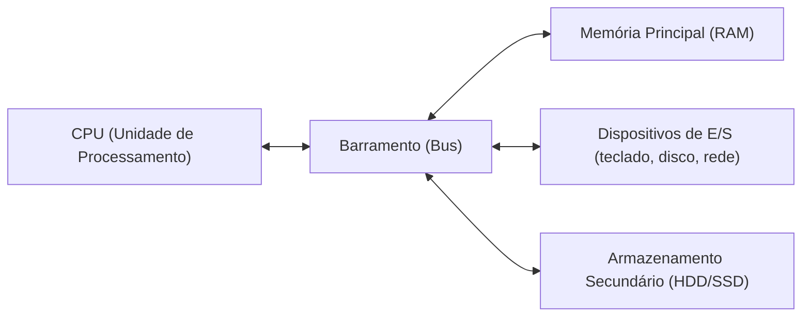
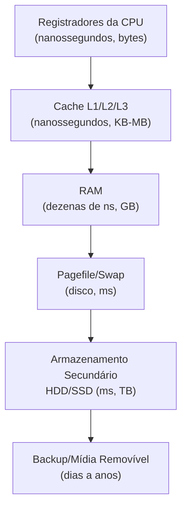

# Arquitetura de Computadores para Forense Digital

> [!info] Sobre esta nota
> Base conceitual que sustenta todas as outras notas do vault ([Forense Digital em Windows](../Windows/Forense%20Digital%20em%20Windows.md), [DFIR em Linux](../Linux/DFIR%20em%20Linux.md), [Forense de Memória em Linux](../Linux/Forense%20de%20Memória%20em%20Linux.md), [Forense de Memória em Windows](../Windows/Forense%20de%20Memória%20em%20Windows.md)). Entender **por que** a ordem de volatilidade existe, **por que** a RAM se perde ao desligar, e **como** o kernel gerencia tudo isso é o que transforma "decorar comandos" em "entender o que está de fato acontecendo" durante uma investigação.

---

## 1. Por que Arquitetura Importa para Forense

Toda decisão de aquisição forense (o que coletar primeiro, o que se perde ao desligar, onde procurar um artefato) deriva diretamente de **como o hardware e o sistema operacional funcionam por baixo**. Se você entende a arquitetura, você não precisa decorar "colete a RAM antes do disco" como uma regra arbitrária — você entende **fisicamente por que** isso é verdade.

Esta nota cobre, em ordem: **CPU → Hierarquia de Memória → Armazenamento → Kernel → Boot → Volatilidade aplicada**.

---

## 2. Arquitetura Base — Von Neumann

A grande maioria dos computadores modernos segue (com variações) o modelo de **Von Neumann**: um único espaço de memória compartilhado guarda tanto os **dados** quanto as **instruções** do programa em execução.



**Componentes centrais:**

| Componente                   | Função                                                                                                                  |
| ---------------------------- | ----------------------------------------------------------------------------------------------------------------------- |
| **CPU**                      | Executa instruções — busca, decodifica e roda o código                                                                  |
| **Memória Principal (RAM)**  | Guarda dados e instruções que a CPU está usando **agora**                                                               |
| **Barramento (Bus)**         | "Estradas" que conectam CPU, memória e dispositivos — dados de endereço, dados propriamente ditos, e sinais de controle |
| **Armazenamento Secundário** | HDD/SSD — persiste dados mesmo sem energia                                                                              |
| **Dispositivos de E/S**      | Teclado, mouse, rede, tela — entrada e saída de dados do sistema                                                        |

> [!tip] Implicação forense imediata
> Como CPU e RAM compartilham o mesmo barramento e trabalham em conjunto o tempo todo, **tudo que um programa está fazendo neste exato instante existe fisicamente na RAM (ou nos registradores da CPU)** — não no disco. O disco só reflete o que foi explicitamente salvo.

---

## 3. A CPU (Unidade Central de Processamento)

### 3.1 Registradores

Os **registradores** são pequenas unidades de armazenamento **dentro da própria CPU** — a memória mais rápida e mais próxima do processamento que existe. Guardam temporariamente: o endereço da próxima instrução (Program Counter), resultados intermediários de operações, endereços de memória sendo acessados, e flags de estado (ex: se a última operação resultou em zero, overflow, etc.).

| Registrador (x86-64, exemplo) | Função típica |
|---|---|
| `RIP` | Endereço da próxima instrução a ser executada (Instruction Pointer) |
| `RAX`, `RBX`, `RCX`, `RDX` | Registradores de uso geral — operações aritméticas, retorno de função |
| `RSP` | Ponteiro de topo da pilha (Stack Pointer) |
| `RBP` | Ponteiro base do frame de pilha atual (Base Pointer) |
| `RFLAGS` | Flags de estado da última operação (zero, carry, overflow, etc.) |

> [!danger] O dado mais volátil que existe
> Registradores mudam a cada **ciclo de clock** (bilhões de vezes por segundo). É fisicamente impossível "capturar" seu estado de forma prática durante uma investigação padrão — quando uma ferramenta de dump de memória lê a RAM, o conteúdo dos registradores daquele exato instante já se foi. É por isso que a RFC 3227 (ver nota de aquisição) coloca registradores no topo absoluto da ordem de volatilidade, mas na prática o foco investigativo real começa na RAM.

### 3.2 Cache (L1, L2, L3)

Entre os registradores (ultra-rápidos, mas minúsculos) e a RAM (grande, mas mais lenta) existe a **memória cache** — cópias de dados frequentemente acessados, guardadas fisicamente mais perto do núcleo do processador.

| Nível | Localização | Velocidade | Tamanho típico |
|---|---|---|---|
| **L1** | Dentro de cada núcleo | Mais rápida | Poucos KB (ex: 32–64 KB) |
| **L2** | Próxima de cada núcleo (às vezes compartilhada em pares) | Rápida | Centenas de KB a poucos MB |
| **L3** | Compartilhada entre todos os núcleos do chip | Mais lenta que L1/L2, ainda muito mais rápida que RAM | Vários MB a dezenas de MB |

> [!example] Analogia prática
> Pense em uma cozinha: os registradores são os ingredientes na sua mão agora. O cache é a bancada ao seu lado (pega rápido, mas cabe pouco). A RAM é a geladeira (mais devagar pra pegar, mas cabe muito mais). O disco é o supermercado (demora, mas guarda tudo por muito tempo mesmo sem energia).

**Implicação forense:** o cache é tecnicamente ainda mais volátil que a RAM e, assim como os registradores, não é um alvo prático de aquisição em investigações padrão — mas seu conteúdo eventualmente é sincronizado de volta com a RAM, então indiretamente os efeitos do que passou pelo cache acabam refletidos no dump de memória.

### 3.3 Ciclo de Instrução (Fetch → Decode → Execute)

Toda instrução que a CPU roda segue este ciclo básico:

1. **Fetch (Busca)**: a CPU busca a próxima instrução na memória, no endereço apontado pelo `RIP`/Program Counter
2. **Decode (Decodificação)**: a CPU interpreta o que aquela instrução binária significa (que operação fazer, com quais operandos)
3. **Execute (Execução)**: a operação é de fato realizada — pode envolver ALU (Unidade Lógica Aritmética), acesso à memória, ou I/O
4. **Writeback**: o resultado é gravado de volta em um registrador ou na memória

Esse ciclo se repete bilhões de vezes por segundo (medido em GHz — 1 GHz = 1 bilhão de ciclos por segundo).

### 3.4 Modos de Execução — Kernel Mode vs. User Mode

Processadores modernos (arquitetura x86/x86-64) implementam **níveis de privilégio**, historicamente chamados de **rings** (anéis de proteção):

| Ring | Nome comum | O que roda aqui |
|---|---|---|
| **Ring 0** | Kernel Mode / Modo Supervisor | O núcleo do sistema operacional — acesso irrestrito a hardware, memória, instruções privilegiadas |
| **Ring 1 / Ring 2** | Raramente usados na prática em SOs modernos | Historicamente reservados para drivers/hypervisors em alguns designs |
| **Ring 3** | User Mode / Modo Usuário | Aplicações comuns (seu navegador, seu editor de texto) — acesso restrito, precisa pedir permissão ao kernel para tocar hardware |

> [!warning] Por que isso importa tanto para forense
> Um processo em **User Mode** não pode, por conta própria, ler memória de outro processo, acessar disco diretamente, ou manipular estruturas do kernel. Ele precisa pedir isso ao kernel via **syscall** (chamada de sistema). Malware sofisticado busca justamente **escalar privilégios até Ring 0** (kernel), porque de lá ele pode esconder processos, arquivos e conexões de rede das próprias ferramentas do sistema operacional que rodam em Ring 3 — é exatamente esse o motivo de `psscan` (Volatility) encontrar processos que `pslist` não encontra: `pslist` confia nas listas mantidas pelo kernel; se o kernel foi comprometido (Ring 0), essas listas podem estar mentindo.

### 3.5 Multitarefa e Context Switching

Um processador com poucos núcleos "parece" rodar centenas de processos ao mesmo tempo através de **context switching**: o kernel troca rapidamente entre processos, salvando o estado completo de registradores de um processo (para retomar depois) e carregando o estado de outro.

Essa troca é tão rápida (na ordem de milissegundos ou menos) que cria a ilusão de paralelismo real, mesmo em CPUs com poucos núcleos físicos.

**Implicação forense:** é justamente esse mecanismo de "salvar e restaurar estado de registradores" que faz o kernel manter, para cada processo, uma estrutura de dados na **RAM** com todo o contexto necessário — e são exatamente essas estruturas (`EPROCESS` no Windows, `task_struct` no Linux) que ferramentas como Volatility3 procuram e interpretam durante a análise de memória.

---

## 4. Hierarquia de Memória

Junte tudo que vimos até aqui e a "pirâmide" de volatilidade/velocidade/capacidade fica assim:



Regra geral: **quanto mais rápido, menor a capacidade e maior a volatilidade. Quanto mais lento, maior a capacidade e mais persistente.**

### 4.1 RAM — Memória Principal

A RAM (Random Access Memory) é onde o sistema operacional carrega processos ativos, dados que estão sendo manipulados, e boa parte do próprio kernel.

- **Volátil**: perde todo o conteúdo quando a energia é cortada
- **Endereçamento aleatório**: qualquer posição pode ser acessada diretamente (daí o nome), diferente de uma fita que precisa ser lida sequencialmente
- **DRAM** (Dynamic RAM) é o tipo usado como memória principal — precisa ser constantemente "refrescada" (recarregada eletricamente) para não perder os dados, mesmo com energia ligada

### 4.2 Memória Virtual, Paginação e Swap/Pagefile

O sistema operacional cria a ilusão de que cada processo tem seu próprio espaço de memória enorme e isolado — isso é a **memória virtual**. Por trás dos panos, o kernel mapeia endereços virtuais para endereços físicos reais na RAM, usando **paginação** (a memória é dividida em blocos fixos chamados *páginas*, tipicamente 4 KB).

Quando a RAM física enche, o SO move páginas menos usadas para o disco:

| SO | Nome do mecanismo | Arquivo |
|---|---|---|
| Windows | Paging File | `C:\pagefile.sys` |
| Linux | Swap | Partição de swap dedicada ou arquivo de swap |

> [!tip] Por que isso importa na aquisição
> Dados que "saíram" da RAM física por falta de espaço podem ainda existir no pagefile/swap — por isso, na aquisição Windows com FTK Imager (ver nota correspondente), a opção **"Include Pagefile"** é tão relevante: sem ela, você perde tudo que foi paginado para o disco antes da captura.

### 4.3 Memory-Mapped Files

Uma técnica onde um arquivo em disco é mapeado diretamente no espaço de endereço virtual de um processo, permitindo que o processo o acesse como se fosse memória comum. Muito usado para bibliotecas compartilhadas (DLLs no Windows, `.so` no Linux) e para arquivos grandes que precisam de acesso eficiente.

**Implicação forense:** binários e bibliotecas mapeados dessa forma podem aparecer em análise de memória mesmo que o processo nunca tenha "lido" o arquivo da forma tradicional — é parte do porquê plugins como `windows.dlllist` e `linux.lsof`/`linux.library_list` conseguem reconstruir quais módulos um processo estava usando.

---

## 5. Armazenamento Secundário (Disco)

### 5.1 HDD vs SSD — Diferenças com Peso Forense

| Aspecto | HDD (disco magnético) | SSD (memória flash) |
|---|---|---|
| Tecnologia | Pratos magnéticos girando + cabeça de leitura | Células de memória flash (NAND), sem partes móveis |
| Recuperação de dados apagados | Mais confiável — dado "apagado" geralmente só perde a referência no sistema de arquivos, o conteúdo físico permanece até ser sobrescrito | Menos confiável — o comando **TRIM** pode apagar fisicamente blocos marcados como livres quase imediatamente, mesmo antes de qualquer sobrescrita |
| Wear leveling | Não se aplica | O controlador do SSD redistribui gravações entre células para distribuir o desgaste — isso significa que o *endereço lógico* que o SO vê nem sempre corresponde ao *endereço físico real* onde o dado está, complicando a correlação direta |
| Velocidade de aquisição | Mais lenta | Mais rápida |

> [!danger] TRIM é anti-forense "por padrão"
> Diferente do HDD, onde "deletar" um arquivo é quase sempre recuperável até haver sobrescrita, em SSDs modernos com TRIM habilitado o sistema operacional **avisa proativamente o SSD** sobre blocos livres, e o controlador pode apagá-los fisicamente em segundo plano — às vezes em segundos. Isso significa que a janela de recuperação de arquivos deletados em SSD é dramaticamente menor (ou inexistente) comparada a HDD. Sempre documente se o disco investigado é SSD e se TRIM estava ativo — isso muda completamente a expectativa de sucesso na recuperação de dados apagados.

### 5.2 Por que Espaço "Não Alocado" Importa

Quando um arquivo é deletado, o sistema de arquivos (NTFS, EXT4, etc.) tipicamente só remove a **referência** ao arquivo nas tabelas de metadados e marca aquele espaço como "livre" — o conteúdo físico continua lá até algo novo ser escrito por cima. É exatamente esse princípio que sustenta ferramentas como `ext3grep`, `PhotoRec`, `Foremost` (já vistas na nota de forense Linux) e o `windows.filescan` do Volatility3 (memória).

---

## 6. O Kernel — O Núcleo do Sistema Operacional

### 6.1 O que o Kernel Faz

O **kernel** é o componente central do sistema operacional — a ponte entre o hardware e todo o resto (aplicações, usuário). Roda em **Ring 0** (kernel mode) e tem acesso irrestrito a:

- **Gerenciamento de processos**: criar, escalonar (agendar qual processo roda quando), finalizar processos
- **Gerenciamento de memória**: alocar/desalocar memória, implementar memória virtual e paginação
- **Gerenciamento de dispositivos**: comunicação com hardware via drivers
- **Sistema de arquivos**: interpretar estruturas em disco e apresentar arquivos/diretórios de forma abstrata para as aplicações
- **Segurança e controle de acesso**: aplicar permissões, isolar processos entre si

### 6.2 Syscalls — A Porta de Entrada Controlada

Aplicações em User Mode (Ring 3) **não podem** tocar hardware diretamente. Quando um programa precisa, por exemplo, ler um arquivo ou abrir uma conexão de rede, ele faz uma **chamada de sistema (syscall)** — um pedido formal ao kernel, que valida a permissão e executa a operação em nome do processo.

```
Aplicação (Ring 3) → syscall → Kernel (Ring 0) → Hardware
```

**Implicação forense/ofensiva:** rootkits sofisticados tentam interceptar ou modificar a tabela de syscalls (*syscall hooking*) para filtrar o que o kernel "informa" de volta às ferramentas de análise — por exemplo, escondendo um processo específico da lista retornada quando alguém roda `ps` ou `tasklist`. É por isso que o plugin `linux.check_syscall` (mencionado na nota de memória Linux) existe: ele verifica se a tabela de syscalls foi adulterada.

### 6.3 Estruturas de Processo no Kernel

Cada processo em execução é representado internamente por uma estrutura de dados mantida pelo kernel, guardada na RAM:

| SO | Estrutura | O que guarda |
|---|---|---|
| **Windows** | `EPROCESS` | PID, PPID, ponteiros para threads, handles abertos, informações de memória do processo, tempo de criação, etc. |
| **Linux** | `task_struct` | Praticamente a mesma ideia — PID, estado, memória, arquivos abertos, sinalizadores |

Essas estruturas ficam ligadas entre si em **listas encadeadas** dentro do kernel (ex: no Windows, a `PsActiveProcessHead`; no Linux, listas circulares de `task_struct`). Ferramentas como `pslist`/`linux.pslist` **seguem essas listas** para enumerar processos.

> [!example] A base técnica por trás de `pslist` vs `psscan`
> Agora o motivo fica concreto: `pslist` caminha pela lista encadeada mantida pelo kernel. Se um rootkit remove um nó dessa lista (técnica chamada **DKOM — Direct Kernel Object Manipulation**), o processo desaparece de qualquer ferramenta que confie na lista, incluindo o Gerenciador de Tarefas e o `ps`. Mas a estrutura `EPROCESS`/`task_struct` do processo **continua fisicamente na RAM** — só não está mais "linkada". `psscan`/`linux.psscan` não seguem a lista: eles varrem a memória física inteira procurando por **padrões de bytes característicos** dessas estruturas, encontrando processos mesmo desvinculados da lista.

### 6.4 Kernel Modules e Drivers

O kernel pode carregar código adicional dinamicamente — módulos (Linux: `.ko`, carregados via `insmod`/`modprobe`) ou drivers (Windows: `.sys`). Isso é extremamente poderoso e extremamente perigoso ao mesmo tempo: qualquer módulo carregado no kernel roda com privilégio total de Ring 0.

**É exatamente esse mecanismo que o LiME usa** (ver nota [Forense de Memória em Linux](../Linux/Forense%20de%20Memória%20em%20Linux.md)) para capturar memória — ele se carrega como módulo de kernel justamente para ter acesso direto e completo à RAM física. O mesmo poder que permite forense legítima é o que rootkits em nível de kernel exploram para se esconder.

---

## 7. Boot Process — Do Botão Ligar ao Kernel Rodando

Entender o processo de boot ajuda a contextualizar por que **mídia bootável** (ver nota [Anti-Forense e Ofuscação de Dados](../Anti-Forense/Anti-Forense%20e%20Ofuscação%20de%20Dados.md)) é um vetor anti-forense tão eficaz.


1. **BIOS/UEFI**: firmware da placa-mãe, primeiro código a rodar. Faz testes básicos de hardware (POST) e decide de onde carregar o sistema (disco interno, USB, rede)
2. **Bootloader** (GRUB no Linux, Windows Boot Manager no Windows): carrega o kernel na memória
3. **Kernel**: assume o controle, inicializa drivers, sistema de arquivos, e começa a criar os primeiros processos
4. **Processos de inicialização do SO**: no Linux, `systemd` (PID 1) assume e inicia todos os serviços configurados; no Windows, processos como `wininit.exe`/`services.exe`
5. **Login**: ambiente do usuário fica disponível

> [!tip] Conexão com mídia bootável
> Quando alguém usa um pendrive bootável, o passo 1 (BIOS/UEFI) aponta para um kernel **completamente diferente**, carregado a partir de mídia externa — o disco interno da máquina nunca entra em ação nesse processo, exceto quando explicitamente montado depois. É por isso que essa técnica evita deixar rastros no SO instalado: ele nunca chegou a rodar.

---

## 8. Ordem de Volatilidade Aplicada à Arquitetura

Juntando tudo — aqui está a RFC 3227 (já citada na nota de aquisição) explicada **através** da arquitetura, não apenas como lista decorada:

| Ordem | Componente | Por que essa posição, fisicamente |
|---|---|---|
| 1 | Registradores da CPU | Mudam a cada ciclo de clock (bilhões/segundo) — o dado mais efêmero fisicamente possível |
| 2 | Cache (L1/L2/L3) | Também muda constantemente, mas um pouco "mais devagar" que registradores; sincroniza com RAM |
| 3 | Tabelas de roteamento, cache ARP, RAM | Toda informação de estado ativo do SO e processos — perdida instantaneamente sem energia |
| 4 | Pagefile/Swap | Ainda em disco, mas reflete estado recente de memória — muda com frequência |
| 5 | Disco (dados em repouso) | Persiste sem energia — muda apenas quando há escrita explícita |
| 6 | Backups/mídia remota | Menos volátil de todos — só muda quando o processo de backup roda |

---

## 9. Exemplo Prático — Rastreando um Dado Através da Arquitetura

Cenário didático: você digita uma senha em um formulário de login.

1. **Teclado (I/O)** → sinal elétrico enviado ao controlador, que gera uma interrupção de hardware
2. **Kernel (Ring 0)** trata a interrupção, lê o scancode da tecla e traduz para o caractere correspondente
3. O caractere é entregue à aplicação em **User Mode (Ring 3)** via mecanismos do próprio kernel (buffers de entrada)
4. A aplicação guarda os caracteres digitados em uma variável — fisicamente, isso vive em **registradores** momentaneamente e depois é gravado na **RAM** (na região de memória alocada para aquele processo)
5. Se a aplicação processa a senha (ex: gera um hash), esse processamento passa novamente por **registradores** e **cache** durante os cálculos
6. Se o sistema estiver sob pressão de memória, a página onde essa variável vive pode ser movida para o **pagefile/swap**
7. Só quando (e se) a aplicação decide persistir algo — como um token de sessão — é que um dado relacionado chega ao **disco**

> [!example] Por que isso importa na prática
> Uma senha digitada e usada apenas para autenticação (sem ser salva) **nunca toca o disco**. A única chance de recuperá-la forensicamente é capturar a RAM (ou, teoricamente, o pagefile) **enquanto ainda está lá**. Depois que o processo termina e a memória é reutilizada por outro processo, essa informação se perde para sempre. Esse é o argumento mais direto e concreto para a prioridade de captura de memória em qualquer resposta a incidente.

---

## 10. Comandos Práticos para Explorar a Própria Arquitetura

Úteis para overview rápido do hardware/estado de um sistema (Linux):

```sh
# Informações da CPU: núcleos, cache, modelo, flags de virtualização
lscpu

# Uso e tamanho da memória RAM e swap em tempo real
free -h

# Detalhes de hardware (RAM instalada, tipo, velocidade) — requer root
sudo dmidecode --type memory

# Ver estatísticas de memória do kernel em detalhe
cat /proc/meminfo

# Ver informações de cache de CPU especificamente
lscpu | grep -i cache
```

Equivalente básico no Windows (PowerShell):

```powershell
# Informações de CPU
Get-CimInstance Win32_Processor | Select-Object Name, NumberOfCores, L2CacheSize, L3CacheSize

# Informações de memória física instalada
Get-CimInstance Win32_PhysicalMemory | Select-Object Capacity, Speed, Manufacturer

# Uso atual de memória
Get-CimInstance Win32_OperatingSystem | Select-Object FreePhysicalMemory, TotalVisibleMemorySize
```

---

## 11. Checklist — Conceitos para Revisar Antes de uma Investigação

1. [ ] Entendo por que registradores/cache não são alvo prático de aquisição, mas RAM é
2. [ ] Sei explicar por que o pagefile/swap pode conter dados que "saíram" da RAM física
3. [ ] Entendo a diferença entre Ring 0 (kernel) e Ring 3 (user) e por que isso afeta o que malware consegue esconder
4. [ ] Sei explicar tecnicamente por que `psscan`/`linux.psscan` encontram processos que `pslist`/`linux.pslist` não encontram (DKOM)
5. [ ] Entendo por que TRIM em SSD reduz drasticamente a recuperabilidade de arquivos deletados comparado a HDD
6. [ ] Sei relacionar o processo de boot com por que mídia bootável evita deixar rastro no SO instalado
7. [ ] Consigo explicar por que uma senha nunca salva em disco só é recuperável via captura de RAM

---

## 12. Referências para Aprofundamento

- Tanenbaum, A. S. — *Modern Operating Systems* (fundamentos de arquitetura, memória virtual e kernel)
- Intel/AMD — manuais de arquitetura x86-64 (para quem quiser ir a fundo em registradores e modos de execução)
- Documentação do kernel Linux (`Documentation/` no repositório oficial) — estruturas como `task_struct`
- Microsoft Docs — arquitetura de processos do Windows (`EPROCESS`, `KPROCESS`)
- Volatility3 Docs — para ver na prática como as estruturas de kernel viram plugins de análise

---

## Ver também
- [Forense Digital em Windows](../Windows/Forense%20Digital%20em%20Windows.md)
- [DFIR em Linux](../Linux/DFIR%20em%20Linux.md)
- [Forense de Memória em Linux](../Linux/Forense%20de%20Memória%20em%20Linux.md)
- [Forense de Memória em Windows](../Windows/Forense%20de%20Memória%20em%20Windows.md)
- [Ring0 — Escalonamento de Privilégio e EDR](../Anti-Forense/Ring0%20-%20Escalonamento%20de%20Privilégio%20e%20EDR.md)
- [Anti-Forense e Ofuscação de Dados](../Anti-Forense/Anti-Forense%20e%20Ofuscação%20de%20Dados.md)
