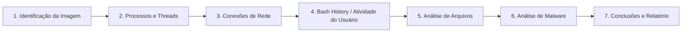

# Forense de Memória em Linux (LiME + Volatility3)

> [!info] Sobre esta nota
> Nota dedicada exclusivamente a **memory forensics em Linux** — aprofunda o ponto que ficou só "registrado como próximo passo" em [DFIR em Linux](DFIR%20em%20Linux.md). Cobre captura com **LiME** e análise com **Volatility3**, do zero até um fluxo de investigação completo.

---

## 1. Por que Forense de Memória Importa

A RAM guarda o **estado vivo** do sistema: processos em execução, conexões de rede ativas, sessões de usuário, e muitas vezes artefatos que **nunca tocam o disco** — malware fileless, chaves de criptografia em uso, comandos digitados recentemente.

**Casos de uso principais:**

- Análise de malware (incluindo técnicas que se escondem de ferramentas de disco)
- Debugging e causa raiz de crashes de sistema
- Detecção de vazamento de dados
- Monitoramento de atividade de usuário (histórico de comandos, sessões)
- Resposta a incidentes — entender exatamente o que o atacante fez enquanto o sistema estava comprometido

> [!warning] Janela de oportunidade
> A memória é o dado mais volátil do sistema (ver ordem de volatilidade na nota de aquisição). Se o sistema reiniciar antes da captura, tudo isso se perde permanentemente.

---

## 2. Ferramentas do Ecossistema

### 2.1 Captura (dump da memória)

| Ferramenta | Tipo | Observação |
|---|---|---|
| **LiME** (Linux Memory Extractor) | Módulo de kernel | A mais usada — hash nativo do dump, aquisição via interface de rede, footprint mínimo no processo, suporta captura completa de memória Android |
| **Fmem** | Módulo de kernel | Simples, exporta memória em formato raw |
| **AVML** | Binário standalone (Microsoft) | Portátil, gera imagem compatível com Volatility sem precisar compilar módulo de kernel |
| **Crash** | Ferramenta de análise de kernel crash | Também consegue extrair dump de sistemas vivos |
| **Memdump** | Ferramenta antiga | Dump de memória de um processo específico (não do sistema todo) |
| **Coredump** | Mecanismo nativo do Linux | Registra o estado de memória de um programa no momento de um crash — útil para debugging pontual |

### 2.2 Análise

| Ferramenta | Observação |
|---|---|
| **Volatility** (2 e 3) | Framework open-source mais usado — Python, arquitetura de plugins, suporta múltiplos SOs e formatos de dump |
| **Rekall / GRR** | Desenvolvido originalmente pelo Google — forte em análise de timeline e coleta rápida de dados |
| **Redline** | Interface amigável, cobre memória e sistema de arquivos |
| **Memoryze for Linux** | Focado em detecção de malware, mais técnico de operar |
| **Linux Memory Grabber** | Script que automatiza captura + reúne as ferramentas necessárias para análise em sequência |

> [!tip] Por que Volatility domina
> É o framework mais atualizado, com maior comunidade e maior compatibilidade de formatos — por isso o resto desta nota foca nele.

---

## 3. Capturando a Memória com LiME

### 3.1 Instalação (Ubuntu)

```sh
# Clonar o repositório do LiME
git clone https://github.com/504ensicsLabs/LiME.git

# Entrar no diretório de código-fonte
cd LiME/src/

# Compilar o módulo para o kernel exato da máquina
make

# Confirmar que o módulo compilou e pode ser carregado
lsmod | grep -i lime
```

> [!warning] O módulo é específico do kernel
> O `.ko` gerado pelo `make` é compilado **para a versão exata do kernel da máquina onde você rodou o comando**. Não é portátil entre sistemas com kernels diferentes — se for capturar em outra máquina, compile lá (ou em um ambiente com o mesmo kernel exato).

### 3.2 Antes de capturar: checar espaço em disco

```sh
# Espaço em disco disponível — precisa ser >= tamanho total da RAM
df -h

# Tamanho total de memória do sistema
free -m
```

### 3.3 Realizando o Dump

```sh
# Ir até o diretório onde o módulo compilado está
cd tools/LiME/src/

# Localizar o arquivo .ko gerado (o nome inclui a versão do kernel)
ls -l lime*.ko

# Carregar o módulo e iniciar a captura — path e format são os parâmetros do próprio módulo
insmod lime-6.5.0-25-generic.ko "path=/var/dumps/ubuntu-memdump.lime format=lime"

# Conferir se o dump foi gerado
ls /var/dumps/
du -sch /var/dumps/ubuntu-memdump.lime
```

> [!example] Formatos suportados pelo LiME
> `raw` (dump linear cru) e `lime` (formato próprio, com metadados e suporte a padding). Para compatibilidade ampla com Volatility, `lime` costuma ser a escolha mais segura.

### 3.4 Hash imediato do dump

Assim que a captura terminar, gere o hash — o mesmo princípio de integridade de qualquer aquisição forense:

```sh
md5sum /var/dumps/ubuntu-memdump.lime
sha256sum /var/dumps/ubuntu-memdump.lime
```

> [!tip] Por que revalidar hash importa ainda mais aqui
> Dumps de memória costumam ser grandes (8/16/24/32 GB, dependendo da RAM da máquina). Transferir arquivos desse tamanho entre sistemas tem risco real de corrupção — sempre recalcule o hash no destino e compare com o valor original antes de considerar a evidência íntegra.

---

## 4. Instalando o Volatility3

Requer Python 3+.

```sh
# Clonar o repositório oficial
git clone https://github.com/volatilityfoundation/volatility3.git

cd volatility3/

# Build e instalação
python3 setup.py build
python3 setup.py install

# Alternativa mínima (só dependências essenciais)
pip3 install -r requirements-minimal.txt
```

---

## 5. Entendendo a Arquitetura do Volatility3

Diferente do Volatility 2 (baseado em "profiles"), o Volatility3 usa três conceitos centrais:

| Componente | O que é |
|---|---|
| **Memory Layers** | Abstrações de diferentes "camadas" de memória — física, virtual, sistema de arquivos — permitindo ao Volatility acessar a imagem em diferentes níveis (ex: uma camada de memória física dá acesso cru à imagem, enquanto uma camada de tradução de endereço virtual replica o layout de memória virtual do SO) |
| **Templates & Objects** | Templates definem estruturas de dados em memória; Objects são instâncias concretas dessas estruturas (ex: um template define "processo", cada processo real encontrado é um object daquele template) |
| **Symbol Tables** | Guardam endereços e layouts de estruturas de dados e funções do kernel — permitem ao Volatility reconhecer e interpretar estruturas específicas dentro da imagem |

Tudo isso é armazenado em um **context**, que funciona como container para as camadas e tabelas necessárias à análise.

### 5.1 ISF — Intermediate Symbol Format

O Volatility3 substitui o antigo "profile" (V2) por um arquivo **ISF** (JSON) contendo a tabela de símbolos do kernel analisado — é isso que permite ao Volatility interpretar corretamente os valores encontrados na memória.

**Duas formas de conseguir o ISF:**

1. **Baixar um já existente** — via ISF server da comunidade Volatility3 Linux (busque pela versão exata do kernel, obtida no banner do dump ou via `uname -r`). Links de download geralmente expiram (ex: 1 hora), então pode ser preciso buscar novamente.
2. **Gerar você mesmo** — quando não existe ISF pronto para aquele kernel específico (comum em kernels customizados ou versões menos populares).

> [!warning] Sem ISF, sem análise
> Tentar analisar um dump sem o ISF correto para aquele kernel resulta em erro — o Volatility literalmente não sabe interpretar as estruturas de memória sem a tabela de símbolos correspondente.

### 5.2 Gerando um ISF com `dwarf2json`

Quando não há ISF pronto disponível, o próprio analista gera um a partir dos símbolos de debug do kernel.

```sh
# Clonar e compilar o dwarf2json (requer Go 1.14+)
git clone https://github.com/volatilityfoundation/dwarf2json.git
cd dwarf2json/
go build
./dwarf2json --help
```

Instalar os pacotes de debug symbols do kernel (Ubuntu):

```sh
echo "deb http://ddebs.ubuntu.com $(lsb_release -cs) main restricted universe multiverse
deb http://ddebs.ubuntu.com $(lsb_release -cs)-updates main restricted universe multiverse
deb http://ddebs.ubuntu.com $(lsb_release -cs)-proposed main restricted universe multiverse" | \
sudo tee -a /etc/apt/sources.list.d/ddebs.list

sudo apt install ubuntu-dbgsym-keyring
sudo apt-key adv --keyserver keyserver.ubuntu.com --recv-keys F2EDC64DC5AEE1F6B9C621F0C8CAB6595FDFF622
sudo apt-get update
```

Instalar o pacote `dbgsym` correspondente à versão exata do kernel:

```sh
uname -r
apt install linux-image-6.5.0-25-generic-dbgsym
ls -lh /usr/lib/debug/boot   # confirma que o vmlinux com símbolos de debug está presente
```

Gerar o arquivo ISF a partir do `vmlinux`:

```sh
./dwarf2json linux --elf /usr/lib/debug/boot/vmlinux-6.5.0-25-generic \
  > /root/tools/volatility3/volatility3/symbols/vmlinux-6.5.0-25-generic.json
```

O arquivo gerado precisa ficar dentro de `volatility3/symbols/` para que o Volatility o encontre automaticamente.

---

## 6. Fluxo Completo de Análise de Memória

Um processo básico de análise de dump Linux segue esta sequência:



### 6.1 Identificação da Imagem

Primeiro passo: confirmar tipo, SO e versão do dump — escolher o ISF errado compromete a confiabilidade de toda a análise.

```sh
# Extrai banner com informações do SO/kernel do dump
python3 vol.py -f /var/dumps/ubuntu-memdump.lime banner

# Hash do dump antes de qualquer análise (integridade)
md5sum /var/dumps/ubuntu-memdump.lime

# Confirmar que o ISF correspondente está presente
ls -l volatility3/symbols/
```

### 6.2 Processos e Threads

```sh
# Lista processos com argumentos completos de execução
python3 vol.py -f /var/dumps/ubuntu-memdump.lime linux.psaux

# Árvore de processos — relação pai/filho
python3 vol.py -f /var/dumps/ubuntu-memdump.lime linux.pstree

# Varredura mais profunda — pega até processos já finalizados mas com rastro em memória
python3 vol.py -f /var/dumps/ubuntu-memdump.lime linux.psscan
```

**Campos-chave nesses outputs:**

| Campo | Significado |
|---|---|
| PID | Identificador único do processo |
| PPID | PID do processo pai |
| COMM | Nome do programa em execução |
| ARGS | Argumentos de linha de comando usados na inicialização |
| OFFSET (P) | Posição do processo no endereço físico de memória (só em `psscan`) |
| TID | Identificador da thread dentro do processo (só em `psscan`) |
| EXIT_STATE | Estado de saída do processo — ver tabela abaixo |

**Valores de `EXIT_STATE` (relevantes em `psscan`):**

| Estado | Significado |
|---|---|
| `TASK_RUNNING` | Processo ativo, rodando normalmente |
| `EXIT_DEAD` | Processo encerrado, recursos já liberados pelo SO |
| `EXIT_ZOMBIE` | Processo encerrado mas ainda listado — o pai ainda não coletou o exit code |
| `EXIT_TRACE` | Parado para monitoramento/debug, aguardando estado de saída |
| `TASK_STOPPED` | Parado por sinal, não está mais rodando |
| `TASK_TRACED` | Sendo rastreado por uma ferramenta de debug |

> [!example] Por que `psscan` importa mais que `psaux`
> `psaux`/`pstree` seguem as listas ligadas do kernel — se um rootkit desvincular um processo dessas listas (técnica clássica de esconder processo), ele desaparece desses comandos. `psscan` varre a memória física em busca de estruturas de processo, então **pega processos escondidos** que não aparecem nas listagens tradicionais. Sempre rode os dois e compare.

### 6.3 Conexões de Rede

```sh
python3 vol.py -f /var/dumps/ubuntu-memdump.lime linux.sockstat

# Filtrar por PIDs específicos
python3 vol.py -f /var/dumps/ubuntu-memdump.lime linux.sockstat --pids 829 907
```

**Campos-chave:**

| Campo | Significado |
|---|---|
| NetNS | Namespace de rede (isolamento/roteamento em Linux) |
| Pid / FD | Processo dono da conexão / file descriptor associado ao socket |
| Family | Família do socket (ex: `AF_INET` para IPv4) |
| Type | Tipo (ex: `STREAM` para TCP) |
| Proto | Protocolo (ex: TCP) |
| Source/Destination Addr e Port | Endereços e portas de origem/destino |
| State | Estado da conexão (`ESTABLISHED`, `LISTEN`, etc.) |

> [!tip] Cruzamento com processos
> Combine o PID de uma conexão suspeita em `sockstat` com o `linux.psaux`/`psscan` correspondente para saber exatamente qual processo (e com quais argumentos) está se comunicando com o IP/porta em questão.

### 6.4 Bash History / Atividade do Usuário

```sh
python3 vol.py -f /var/dumps/ubuntu-memdump.lime linux.bash
```

**Campos-chave:**

| Campo | Significado |
|---|---|
| PID / Process | Processo (shell) que executou o comando |
| CommandTime | Data/hora de execução do comando |
| Command | O comando propriamente dito |

> [!tip] Vantagem sobre o `.bash_history` em disco
> Como visto na nota [DFIR em Linux](DFIR%20em%20Linux.md), o `.bash_history` em disco pode ter sido apagado ou desabilitado (`unset HISTFILE`) como técnica anti-forense. O plugin `linux.bash` lê o **histórico ainda residente em memória do processo do shell**, contornando essa limitação — comandos digitados recentemente podem aparecer mesmo que o atacante tenha limpado o arquivo em disco.

### 6.5 Análise de Arquivos

```sh
# Filtrado por processo específico
python3 vol.py -f /var/dumps/ubuntu-memdump.lime linux.lsof --pid 838
```

**Campos-chave:**

| Campo | Significado |
|---|---|
| PID / Process | Processo dono do file descriptor |
| FD | Número identificador do arquivo/socket para aquele processo |
| Path | Caminho no sistema para o recurso apontado pelo FD |

Isso revela arquivos que um processo suspeito tinha aberto no momento da captura — inclusive arquivos que já foram deletados do disco, mas cujo handle ainda estava aberto (o conteúdo pode às vezes ser recuperado direto da memória).

### 6.6 Análise de Malware

```sh
python3 vol.py -f /var/dumps/ubuntu-memdump.lime linux.vmayarascan --pid 838 \
  --yara-file /root/tools/yara-rules/custom/string_search.yar
```

O `linux.vmayarascan` permite varrer a memória de um processo (ou de todo o dump) usando **regras YARA** — útil para:

- Encontrar amostras de malware conhecidas por assinatura
- Localizar processos escondidos/rootkits
- Buscar padrões específicos (strings sensíveis, chaves de criptografia, IOCs) em memória

Exemplo de regra YARA simples buscando strings específicas:

```yara
rule string_search {
    strings:
        $a = "error"
        $b = "access"
    condition:
        any of them
}
```

Quando o resultado vem em hexadecimal, é possível decodificar diretamente no terminal:

```sh
echo "6572726f72" | xxd -r -p
# saída: error
```

> [!info] Outros plugins úteis de investigação (Volatility3)
> Além dos citados acima, vale explorar: `linux.lsmod` (módulos de kernel carregados — bons candidatos a rootkit se houver algo fora do esperado), `linux.malfind` (procura por regiões de memória com características de injeção de código), `linux.check_syscall` (detecta hooks suspeitos na syscall table), `linux.envars` (variáveis de ambiente dos processos). Rode `python3 vol.py --help | grep -i linux.` para ver a lista completa disponível na sua instalação.

---

## 7. Exemplo Prático — Fluxo Investigativo Completo

Cenário: suspeita de processo malicioso se comunicando com um IP externo.

```sh
# 1. Identificar o dump
python3 vol.py -f /var/dumps/ubuntu-memdump.lime banner

# 2. Listar processos e procurar algo fora do padrão
python3 vol.py -f /var/dumps/ubuntu-memdump.lime linux.psaux

# 3. Confirmar com psscan se há processos escondidos das listas normais
python3 vol.py -f /var/dumps/ubuntu-memdump.lime linux.psscan

# 4. Ver conexões de rede do PID suspeito (ex: 838)
python3 vol.py -f /var/dumps/ubuntu-memdump.lime linux.sockstat --pids 838

# 5. Ver quais arquivos esse processo tem abertos
python3 vol.py -f /var/dumps/ubuntu-memdump.lime linux.lsof --pid 838

# 6. Checar histórico de comandos do shell relacionado
python3 vol.py -f /var/dumps/ubuntu-memdump.lime linux.bash

# 7. Varrer a memória do processo com YARA em busca de IOCs conhecidos
python3 vol.py -f /var/dumps/ubuntu-memdump.lime linux.vmayarascan --pid 838 \
  --yara-file /root/tools/yara-rules/custom/string_search.yar
```

Esse encadeamento — processo → rede → arquivos → histórico → assinaturas — é o esqueleto de praticamente qualquer investigação de memória, independente do caso específico.

---

## 8. Volatility 2 vs Volatility 3 (por que usar o 3)

| Aspecto | Volatility 2 | Volatility 3 |
|---|---|---|
| Base | Python 2 | Python 3 |
| Arquitetura | Tradicional, baseada em profiles | Modular, baseada em symbol tables (ISF) |
| Compatibilidade | Limitada em SOs/kernels mais novos | Suporte mais amplo e atualizado |
| Performance | Cai em dumps grandes | Melhor performance e escalabilidade |
| Comunidade/manutenção | Reduzida (Python 2 EOL) | Ativa, atualizações frequentes |

> [!tip] Quando ainda usar o V2
> Praticamente só em cenários legados muito específicos, ou quando alguma análise pontual só tem plugin equivalente no V2. Para trabalho novo, V3 é a escolha padrão.

---

## 9. Checklist — Análise de Memória em Linux

1. [ ] Verificar espaço em disco disponível (`df -h`) vs. tamanho da RAM (`free -m`) antes de capturar
2. [ ] Capturar com LiME, formato `lime`, salvando fora do disco investigado se possível
3. [ ] Gerar hash (MD5/SHA256) imediatamente após a captura
4. [ ] Confirmar/gerar o ISF correspondente ao kernel exato do sistema-alvo
5. [ ] Rodar `banner` para confirmar SO/kernel do dump
6. [ ] Revalidar o hash no ambiente de análise antes de prosseguir
7. [ ] Rodar `psaux`/`pstree` **e** `psscan` — comparar para achar processos escondidos
8. [ ] Investigar conexões de rede de processos suspeitos (`sockstat`)
9. [ ] Checar arquivos abertos por processos suspeitos (`lsof`)
10. [ ] Extrair histórico de bash residente em memória (`linux.bash`) — inclusive como contorno a anti-forense de limpeza de `.bash_history`
11. [ ] Rodar varredura YARA (`vmayarascan`) contra IOCs/regras conhecidas
12. [ ] Documentar tudo e escrever o relatório com timeline, sistemas afetados, ameaças identificadas e ações recomendadas

---

## 10. Referências para Aprofundamento

- Documentação oficial do Volatility3: https://volatility3.readthedocs.io/en/latest/basics.html
- Repositório do LiME: https://github.com/504ensicsLabs/LiME
- Repositório do dwarf2json: https://github.com/volatilityfoundation/dwarf2json
- Volatility3 Linux ISF Server (símbolos pré-compilados)
- Documentação de regras YARA — para escrever assinaturas customizadas de detecção

---

## Ver também
- [DFIR em Linux](DFIR%20em%20Linux.md)
- [Forense de Memória em Windows](../Windows/Forense%20de%20Memória%20em%20Windows.md)
- [Arquitetura de Computadores para Forense Digital](../Fundamentos/Arquitetura%20de%20Computadores%20para%20Forense%20Digital.md)
- [Ring0 — Escalonamento de Privilégio e EDR](../Anti-Forense/Ring0%20-%20Escalonamento%20de%20Privilégio%20e%20EDR.md)
